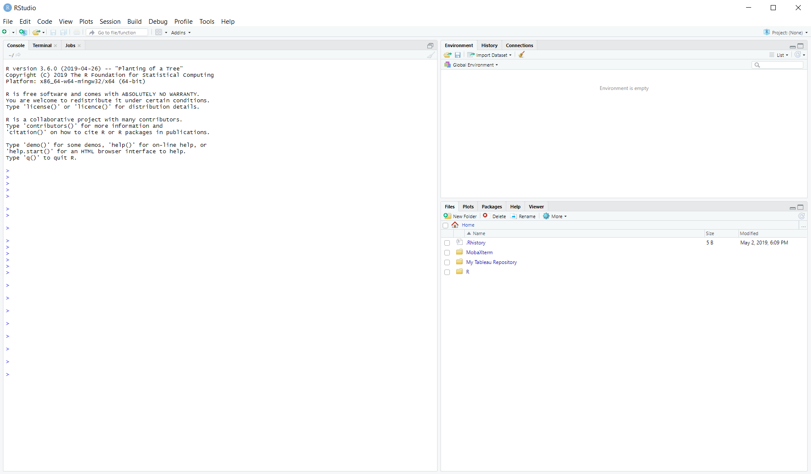
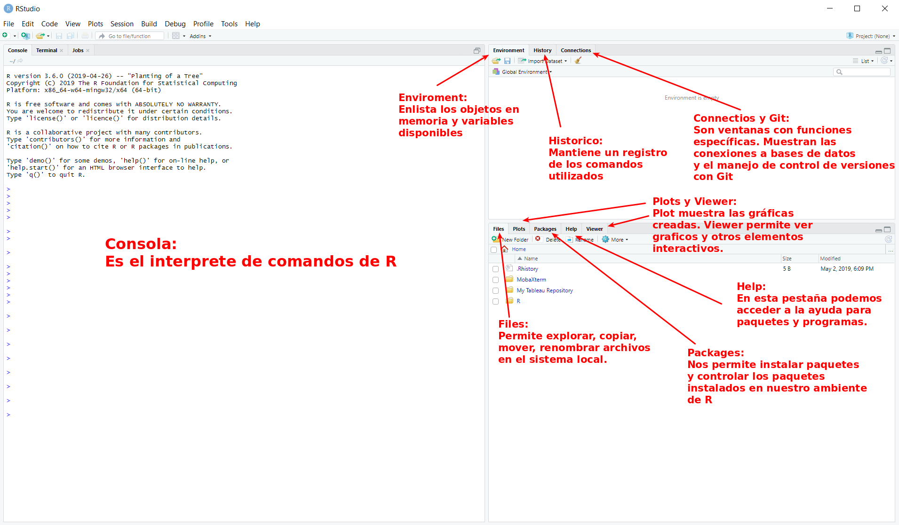
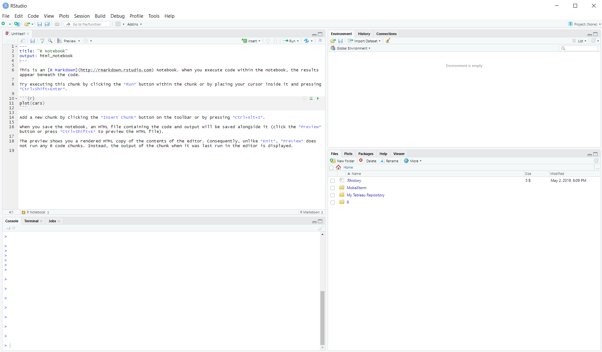
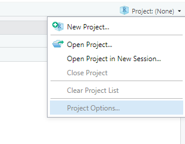
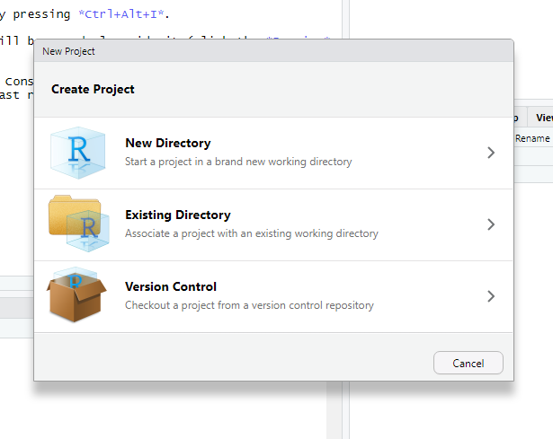
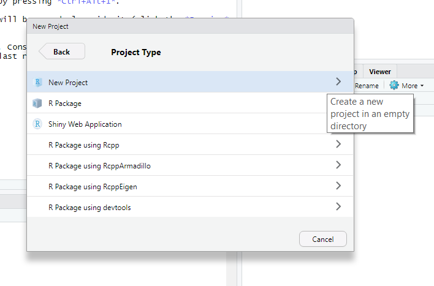
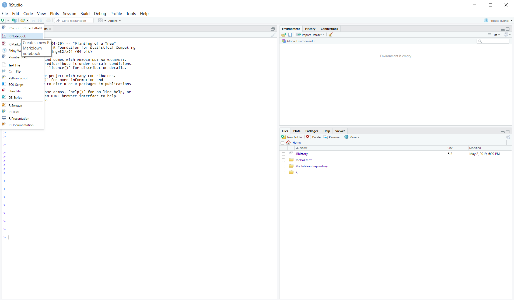
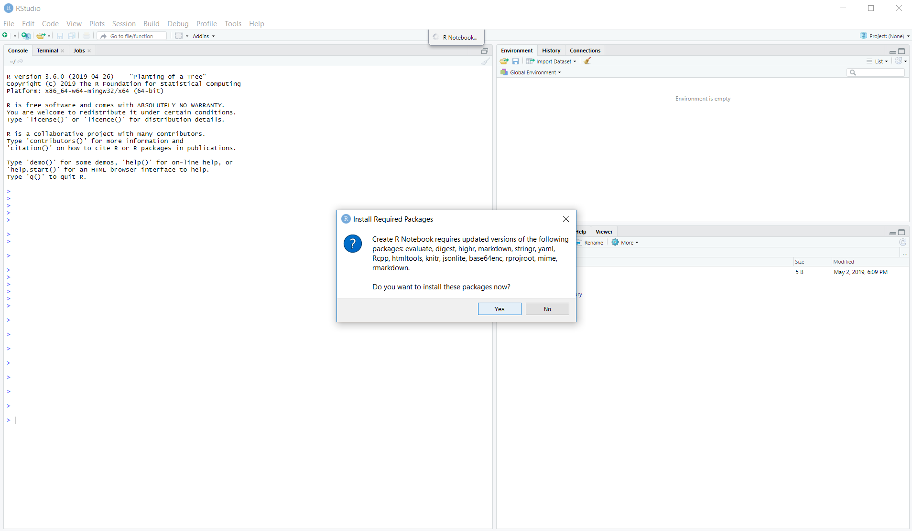
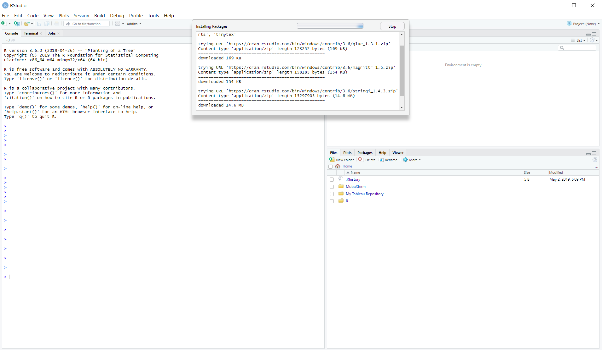

```{r setup, include=FALSE}
knitr::opts_chunk$set(echo = FALSE)
```

## Inicio
La primera vez que iniciamos R nos aparecen una interfaz con por lo menos 
tres secciones

{height=400px}

## Descripción de secciones

{height=500px}

## El cuarto panel

Cuando abrimos algún archivo sea un script, una presentación o un notebook. Se abre un cuarto panel
con el contenido del archivo

{height=400px}

## Ventajas

- Ejecución linea por liena con `Ctrl + Enter`
- Disponibilidad de acceder a historico, editor, enviroment y mas utilidades
- Sintaxis a color para un desarrollo mas sencillo
- Corrección de errores
- Depuración controlada 
- Es software libre

## Panacea {.center}

Una utilidad poco explotada son los proyectos de Rstudio. 



## ¿Que son los proyectos?

Imagina que puedes tomar una foto instantanea de un momento en tu vida y guardarla.

Despues poder utilizarla como punto de partida.

Mantiene tu espacio de trabajo en las mismas condiciones en que lo dejaste. Con los mismos 
archivos y con las variables en memoria.

## Ventaja de los proyectos

- Guardan la posicion en tu archivo e incluso la línea en la que trabajabas
- Mantienen tus variables en memoria
- Aíslan cada desarrollo, de tal forma que puedes cambiar entre uno o mas tareas
sin afectar a las otras o mezclando variables.
- Determinan en automático tu directorio de trabajo y lo mantienen así.
- Pueden tener como base un repositorio de Github

## Opciones importantes

Cuando se crea un proyecto se plantean tres caminos: **crear un directorio**, **usar directorio existente** y **usar un repositorio**



## Una vez seleccionado

Si seleccionamos _"Version control"_(la cajita) nos llevara a un menú en donde pedira una dirección
del repositorio. Dado que esto sale del alcance de este tema solo agregare que se necesita una instalación
de git para descargar la información del repositorio.

Para la opción del _"Directorio existente"_ solo queda determinar la dirección del mismo para comenzar.

## Nuevo Directorio

Esta opción, en general la mas usada, nos presenta mas de 7 opciones, de las cuales **nuevo proyecto** nos permitira, determinar el lugar y nombre del directorio.



## Scripts

Los scripts son **simples** archivos de texto que se guardan con una extension `.R`.
Estos archivos pueden ser ejecutados línea por línea o en su totalidad con el boton de **Run**.
También es posible ejecutarlos desde una terminal con el comando `Rscript`

```{r echo=TRUE, eval=FALSE}
Rscript MiScript.R
```

En windows debemos usar el programa `Rscript.exe`

> En Rstudio tenemos la ventaja de que la sintaxis se colorea y nos muestra los errores en el código.

## NoteBooks

Otro tipo de archivo que destaca, son los "Notebooks" de R.
Estos archivos de extensión de RMarkdown `Rmd` permiten combinar texto plano al cual podemos darle 
formato usando **Markdown**. Ademas permite incluir fragmentos de código que se ejecutan y son responsivos.

Con ellos se pueden generar análisis que se ejecutan y responden a nuestras modificaciones, pero que
se pueden ejecutar en su totalidad para generar un reporte que se actualice automáticamente con los 
nuevos datos. Exportando el resultado a PDF y Word con tan solo presionar un botón.

## Iniciar un Notebook

{height=500px}

## Paquetes necesarios

Este tipo de archivos requieren paquetes específicos, sin embargo **Rstudio** en automático
instalará los paquetes necesarios

{height=400px}

## Instalación

{height=500px}

## Markdown

Este es un lenguaje de marcado ligero, es decir permite modificar y definir
el formato de un archivo mediante una serie de simbolos sencillos que determinan las 
secciones de un archivo.

Depende de la colocación para definir títulos, subtitulos, negritas, cursivas, bullet points
 y otras mas...
 
Existen diferentes sabores de Markdown R tiene el suyo **Rmarkdown**
 
## Tips

- `Ctrl + Click Mouse` sobre una función nos lleva a la definición de la función
- `Ctrl + Alt + Shift M` al colocarlo sobre una variable, cambia todas las coincidencias 
- El segundo boton a la izquierda de `Run` permite ver un arbol de las secciones de un script.
- En la parte de abajo a la izquieda del editor de archivos se puede seleccionar secciones del documento.
