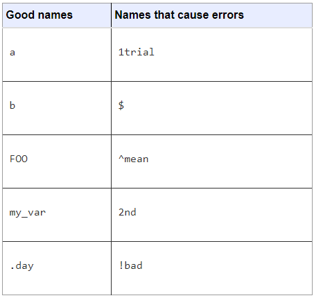

```{r setup, include=FALSE}
knitr::opts_chunk$set(echo = FALSE)
```

## Problema

En nuestra labor como psicólogos, ya sea en investigación o en mbitos laborales,  será probable que necesitemos realizar el análisis estadístico de algún tipo de dato.

Dentro de la carrera se imparten varios cursos sobre estadástica, para su aplicación requerimos de softwares especializados.


## Problema

Dentro de la facultad son pocos los espacios donde se enseñen a manejar estos programas. 


## Introducción a la lógica programación 

La lógica de la programación es la organización coherente de las instrucciones del programa para que su objetivo sea alcanzado.

La lógica es la técnica utilizada para desarrollar instrucciones en una secuencia para lograr determinado objetivo.

Es la organizacién y planificacién de instrucciones en un algoritmo, con el objetivo de tornar visible la implementacién de un programa o software.

## Algoritmo
El algoritmo es la propia secuencia de instrucciones para la ejecución de una tarea.
La información en un algoritmo tiene que ser clara y detallada, tener una secuencia correcta y bien definida de las acciones

Inicio 
 
 1
 
 2
 
 3 
 
 etc.

Fin 

## Algoritmos 

Hay diversas formas de representar un algoritmo, como formas gráficas, flujogramas, formas textuales o en pseudocódigo.


## Programación en  R


## Intefaz de R Studio


##Objetos

¿Qué es un objeto? Solo un nombre que puede utilizar para recuperar los datos almacenados. Por ejemplo, puede guardar datos en un objeto como a o b. 

Para crear un objeto R, elija un nombre y luego use el símbolo menor que, <, seguido de un signo menos, -, para guardar los datos en él. Esta combinación parece una flecha, <-

```{r echo=TRUE}
a <- 5
b <- 6
```

##Los objetos aparecerán en el environment


##Relgas para los objetos 

Puede nombrar un objeto en R casi cualquier cosa que desee, pero hay algunas reglas. Primero, un nombre no puede comenzar con un número. Segundo, un nombre no puede usar algunos símbolos especiales, como ^,!, $, @, +, -, /, o *:



##Relgas para los objetos 
R sobrescribirá cualquier información previa almacenada en un objeto sin pedirle permiso. Por lo tanto, es una buena idea no usar nombres que ya están en uso:

```{r echo=TRUE}
mi_numero <- 1
mi_numero
## 1

mi_numero <- 999
mi_numero
```

## Operciones básicas en R 

*Operaciones Aritméticas*

1.( + Adicción)

2.( - Sustracción)

3.( * Multiplicación)

4.( / División)

5.( ^ Exponente )


```{r echo=TRUE}
(1 + 2) - (3 * 4) / 5 
```

## Operaciones básicas en R

*Operaciones lógicas*
- != No Igual

- == Igual

- < Menor que 

- > Mayor que

- <= Menor que o igual 

- >= Mayor que o igual 

- & y (and)

- | o (or)

- ! no
