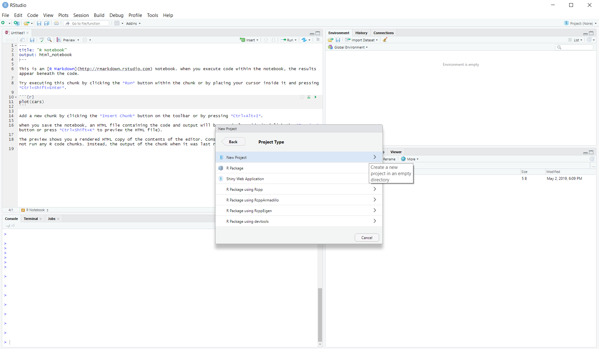

Texto Normal
Termina linea con dos espacios para nuevo párrafo.  

*cursiva* y _cursiva_

**negrita** y __negrita__

superíndice^2^

~~tachado~~

[Enlace](www.rstudio.com)

# Encabezado 1

## Encabezado 2

### Encabezado 3

#### Encabezado 4

##### Encabezado 5

###### Encabezado 6

raya em: --

raya em: ---

elipsis: ...

ecuación en línea: $A = \pi*r^{2}$

imagen: 

regla horizontal:

***

> cita en bloque

* lista sin orden
* elemento 2
 + sub-elemento 1
 + sub-elemento 2

1. lista ordenada
2. elemento 2
 + sub-elemento 1
 + sub-elemento 2
 
Encabezado Tabla | Segundo Encabezado
----------------- | -------------------
Celda de tabla | Celda 2
Celda 3 | Celda 4 